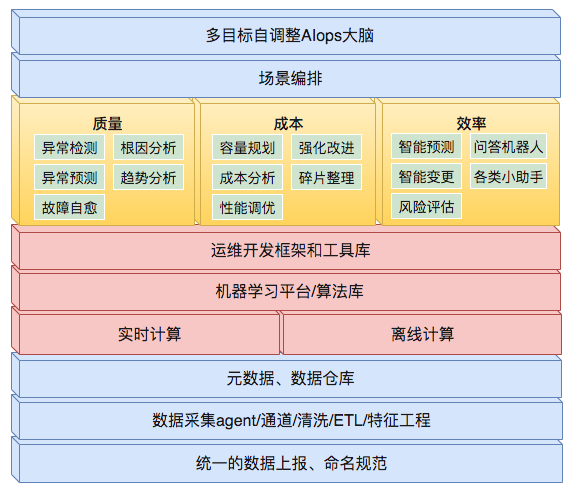

# AIOps 探索及实践

## 背景

AIOps，最初的定义是Algorithm IT Operations，是利用运维算法来实现运维的自动化，最终走向无人化运维。随着技术成熟，逐步确定为Artificial Intelligence for IT Operations——智能运维，将人工智能应用于运维领域，基于已有的运维数据（日志、监控信息、应用信息等），通过机器学习的方式来进一步解决自动化运维无法解决的问题。

早期的运维工作大部分是由运维人员手工完成的，手工运维在互联网业务快速扩张、人力成本高企的时代，难以维系。于是，自动化运维应运而生，它主要通过可被自动触发、预定义规则的脚本，来执行常见、重复性的运维工作，从而减少人力成本，提高运维的效率。总的来说，自动化运维可以认为是一种基于行业领域知识和运维场景领域知识的专家系统。随着整个互联网业务急剧膨胀，以及服务类型的复杂多样，“基于人为指定规则”的专家系统逐渐变得力不从心，自动化运维的不足，日益凸显，当前在业务监控和运维层面也面临着同样的困境。

DevOps的出现，部分解决了上述问题，它强调从价值交付的全局视角，但DevOps更强调横向融合及打通，AIOps则是DevOps在运维（技术运营）侧的高阶实现，两者并不冲突。AIOps不依赖于人为指定规则，主张由机器学习算法自动地从海量运维数据（包括事件本身以及运维人员的人工处理日志）中不断地学习，不断提炼并总结规则。AIOps在自动化运维的基础上，增加了一个基于机器学习的大脑，指挥监测系统采集大脑决策所需的数据，做出分析、决策，并指挥自动化脚本去执行大脑的决策，从而达到运维系统的整体目标。综上看，自动化运维水平是AIOps的重要基石，而AIOps将基于自动化运维，将AI和运维很好地结合起来，这个过程需要三方面的知识：
1. 行业、业务领域知识、跟业务特点相关的知识经验积累，熟悉生产实践的难题
2. 运维领域知识，如指标监控、异常检测、故障发现、故障止损、成本优化、容量规划和性能调优等
3. 算法、机器学习知识、把实际问题转化为算法问题，常用算法包括如聚类、决策树、卷积神经网络

## 技术路线规划

AIOps的建设可以有无到局部的单点探索，在单点探索上得到初步的成果，在对单点能力进行完善，形成解决某个局部问题的运维AI学件，再由多个具体的AI能力的单运维能力点组合成一个智能运维流程。
行业通用的演进路线如下：
1. 开始尝试应用AI能力，还无较为成熟的单点应用
2. 具备单场景的AI运维能力，可以初步形成供内部使用的学件
3. 有由多个单场景AI运维模块串联起来的流程化AI运维能力，可以对外提供可靠的AI学件
4. 主要运维场景均已实现流程化免干预AI运维能力，可以对外提供可靠的AIOps服务
5. 有核心中枢AI，可以在成本。质量。效率件从容调整，达到业务不同生命周期对三个方面不同的指标要求，可实现多目标下的最优或按需最优

注：学件，也称AI运维组件（南京大学周志华老师原创），类似程序中的API或公共库，但API及公共库不含具体业务数据，只是某种算法，而AI运维组件（或称学件），则是类似API的基础上，兼具对某个运维场景智能化解决“记忆”能力，能将出，。里这个场景的只能规则保存在这个组件中，学件（Learnware) = 模型（Model） + 规约（Specification）。
AIOps具体能力框架如下：

AIOps能力框架图

