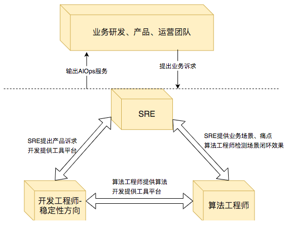
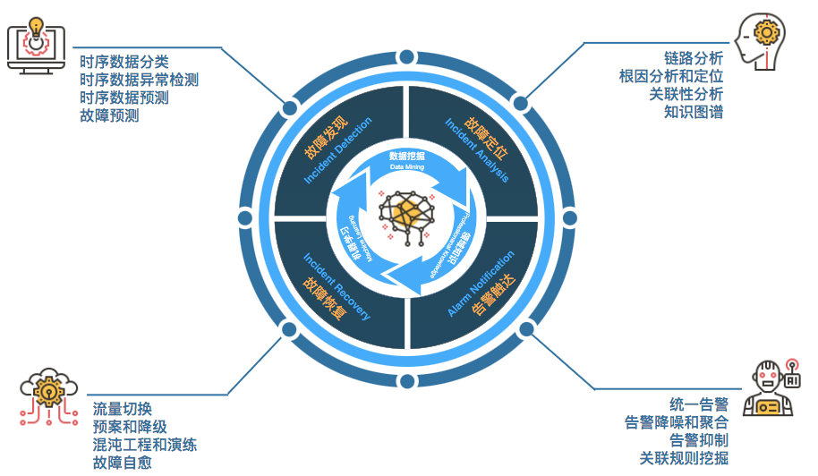
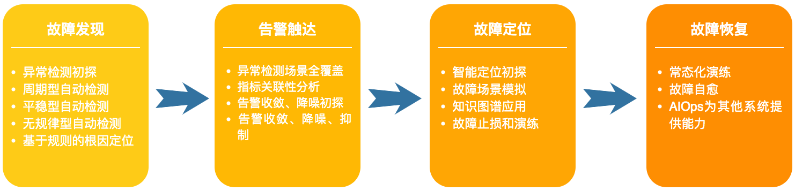
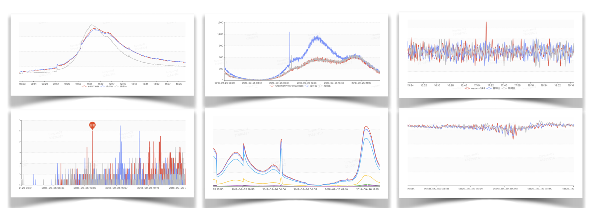
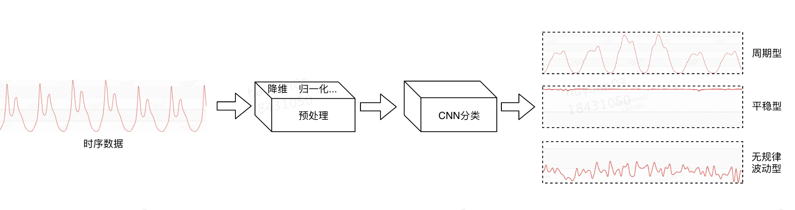
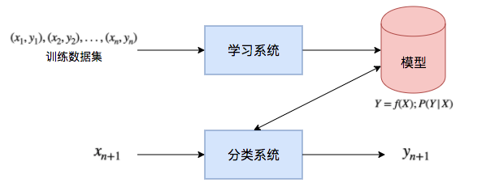
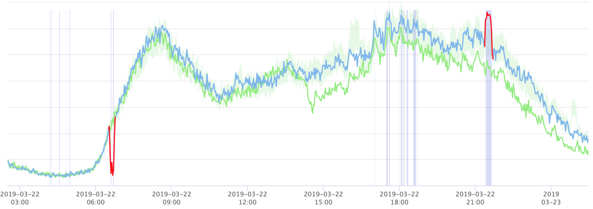
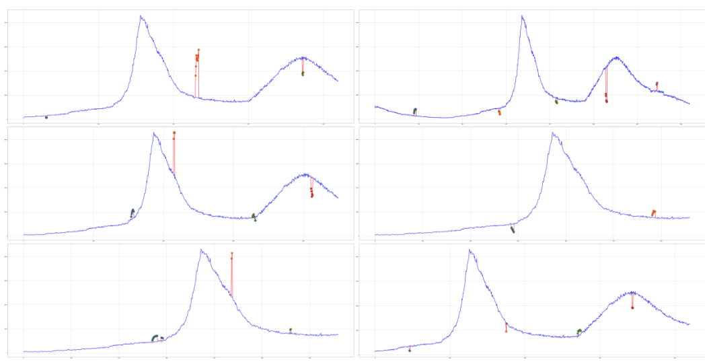
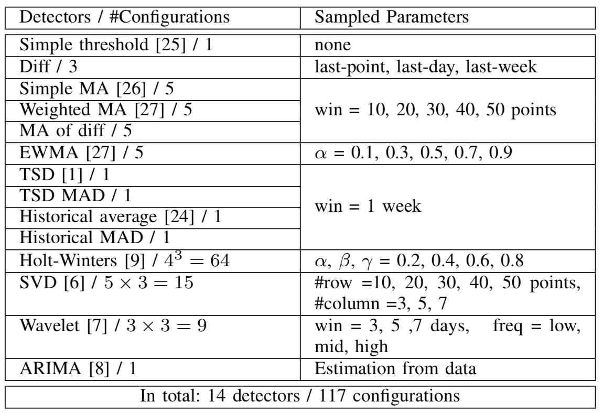
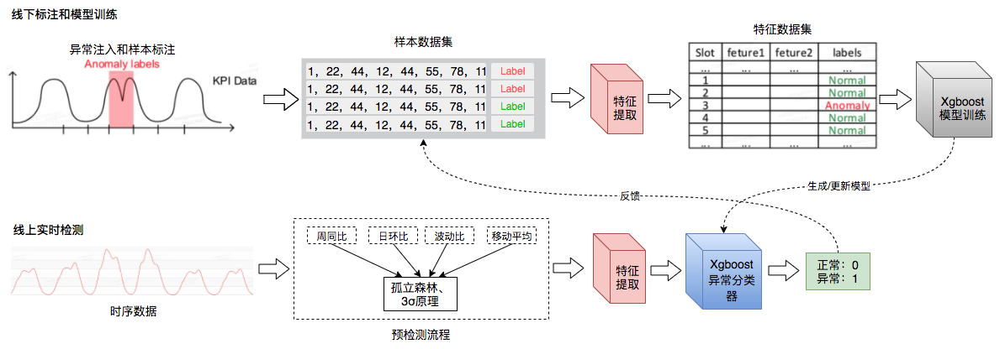

# AIOps 探索及实践

## 背景

AIOps，最初的定义是Algorithm IT Operations，是利用运维算法来实现运维的自动化，最终走向无人化运维。随着技术成熟，逐步确定为Artificial Intelligence for IT Operations——智能运维，将人工智能应用于运维领域，基于已有的运维数据（日志、监控信息、应用信息等），通过机器学习的方式来进一步解决自动化运维无法解决的问题。

早期的运维工作大部分是由运维人员手工完成的，手工运维在互联网业务快速扩张、人力成本高企的时代，难以维系。于是，自动化运维应运而生，它主要通过可被自动触发、预定义规则的脚本，来执行常见、重复性的运维工作，从而减少人力成本，提高运维的效率。总的来说，自动化运维可以认为是一种基于行业领域知识和运维场景领域知识的专家系统。随着整个互联网业务急剧膨胀，以及服务类型的复杂多样，“基于人为指定规则”的专家系统逐渐变得力不从心，自动化运维的不足，日益凸显，当前在业务监控和运维层面也面临着同样的困境。

DevOps的出现，部分解决了上述问题，它强调从价值交付的全局视角，但DevOps更强调横向融合及打通，AIOps则是DevOps在运维（技术运营）侧的高阶实现，两者并不冲突。AIOps不依赖于人为指定规则，主张由机器学习算法自动地从海量运维数据（包括事件本身以及运维人员的人工处理日志）中不断地学习，不断提炼并总结规则。AIOps在自动化运维的基础上，增加了一个基于机器学习的大脑，指挥监测系统采集大脑决策所需的数据，做出分析、决策，并指挥自动化脚本去执行大脑的决策，从而达到运维系统的整体目标。综上看，自动化运维水平是AIOps的重要基石，而AIOps将基于自动化运维，将AI和运维很好地结合起来，这个过程需要三方面的知识：
1. 行业、业务领域知识、跟业务特点相关的知识经验积累，熟悉生产实践的难题
2. 运维领域知识，如指标监控、异常检测、故障发现、故障止损、成本优化、容量规划和性能调优等
3. 算法、机器学习知识、把实际问题转化为算法问题，常用算法包括如聚类、决策树、卷积神经网络

## 技术路线规划

### AIOps能力建设

AIOps的建设可以有无到局部的单点探索，在单点探索上得到初步的成果，在对单点能力进行完善，形成解决某个局部问题的运维AI学件，再由多个具体的AI能力的单运维能力点组合成一个智能运维流程。
行业通用的演进路线如下：
1. 开始尝试应用AI能力，还无较为成熟的单点应用
2. 具备单场景的AI运维能力，可以初步形成供内部使用的学件
3. 有由多个单场景AI运维模块串联起来的流程化AI运维能力，可以对外提供可靠的AI学件
4. 主要运维场景均已实现流程化免干预AI运维能力，可以对外提供可靠的AIOps服务
5. 有核心中枢AI，可以在成本。质量。效率件从容调整，达到业务不同生命周期对三个方面不同的指标要求，可实现多目标下的最优或按需最优

注：学件，也称AI运维组件（南京大学周志华老师原创），类似程序中的API或公共库，但API及公共库不含具体业务数据，只是某种算法，而AI运维组件（或称学件），则是类似API的基础上，兼具对某个运维场景智能化解决“记忆”能力，能将出，。里这个场景的只能规则保存在这个组件中，学件（Learnware) = 模型（Model） + 规约（Specification）。
AIOps具体能力框架如下：

AIOps能力框架图

### 关联团队建设
AIOps团队内部人员根据职能可分为三类团队，分别为SRE团队，开发工程师（稳定保障方向）团队和算法工程师，他们在AIOps相关工作中分别扮演不同的角色，三者缺一不可，SRE能从业务的技术运营中提炼出智能化的需求点，在开发实施前能够考虑好需求方案，产品上线后能对产品数据进行持续的运营。开发工程师负责进行平台相关功能和模块的开发，以降低用户的使用门槛，提升用户的使用效率，根据企业AIOps程度和能力的不同，运维自动化平台开发和运维数据平台开发的权重不通，在工程落地上能考虑好健壮性、鲁棒性、扩展性等，合理拆分任务，保障成果落地。算法工程师则是针对来自SRE的需求进行理解和梳理，对业界方案、相关论文、算法进行调研和尝试，完成最终算法落地方案的输出工作，并不断迭代优化。各团队关系图如下

AIOps关联团队关系图

### 演进路线
当前在质量保障方面的诉求最为迫切，服务运维部先从故障管理领域探索AIOps实践。在故障管理体系中，从故障开始到结束主要有四大核心能力，机故障发现、告警触达、故障定位、故障恢复。
1. 故障发现包含了指标预测、异常检测和故障预测等方面、主要目标是能够及时、准确的发现故障
2. 告警触达包含了告警事件的收敛、聚合和抑制，主要目标是降噪聚合、减少干扰
3. 故障定位包含了数据收集、根因分析、关联分析、智能分析等，主要目标是能及时、精确的定位故障根因
4. 故障恢复部分包含了流量切换、预案、降级等，主要目标是及时恢复故障、减少业务的损失

具体关系如下

故障管理体系核心能力关系图

其中在故障管理智能化的过程中，故障发现作为故障管理中最开始的一环，在当前海量指标场景下，自动发现故障和自动异常检测的需求甚为迫切，能极大的简化研发策略配置成本，提高告警的准确率，减少告警风暴和误报，从而提高研发的效率。除此之外，时序数据异常检测其实是基础能力，在后续告警触达和故障恢复环节中，存在大量指标需要进行一场检测，所以讲故障发现作为当前重点探索目标，解决当前海量数据场景下人工配置和运营告警策略、告警风暴和准确率不高的核心痛点。整个AIOps体系的探索和演进路线如下图所示。每个环节均有独立的产品演进，故障发现-MAFS、告警触达-告警中心、故障定位-雷达、故障恢复-雷达预案

AIOps在故障管理方面的演进路线

## AIOps之故障发现
从目前大多数行业监控体系可以发现，绝大多数监控数据均为时序数据（Time Series），时序数据的监控在公司故障发现过程中扮演者不可或缺的角色。然而从海量的时序数据指标中可以发现，指标种类繁多、关系复杂。在指标本身的特点上有周期性、规律突刺、整体抬升和下降、低峰值等特点，在影响因素上，有节假日、临时活动、天气、疫情等因素。原有的监控系统的固定阈值类监控策略想要覆盖上述种种场景变得越来越困难，并且指标数量众多，在策略配置和优化运营商人力成本将成倍增长，若在海量指标监控上能根据指标自动适配合适的策略不需要人为参与将极大的减少SRE和研发同学在策略配置和运营上的时间成本，也可以让SRE和研发人员把更多的精力用在业务研发上，从而产生更多的价值，更好的服务于业务和用户

时序数据种类多样性

### 时序数据自动分类
在时序数据异常检测中对于不同类型的时序数据，通常需要设置不通的告警规则。比如对于CPU Load曲线，往往波动剧烈，如果设置固定阈值，瞬时的高涨经常会产生误报，SRE和研发人员需要不断的调整阈值和检测窗口来减少误报，当前，通过参考历史同期数据可以一定程度上避免这一情况。如果系统能够提前预判该时序数据类型，给出合理的策略配置建议，就可以提升告警配置体验，甚至做到自动化配置。而在异常检测中时序数据分类通常也是智能化的第一步，只有还是先只能化分类，才能自动适配相应的策略

目前时间序列分类主要有两种方法，无监督聚类和基于监督学习的分类

#### 分类器的选择
根据当前监控系统中时序数据的特点，以及业内的实践，将所有指标可以抽象成三种类别：周期型、平稳型和无规律波动型，这种分类方式经历了三个阶段的探索：单分类器分类、多弱分类器集成决策分类和卷积神经网络分类，通过查阅相关资料，检索到美团的相关试验数据如下：
1. 单分类器分类：训练了SVM、DBSCAN、One-Class-SVM（S3VM）三种分类器，平均分类准确率达到80%左右，但无规律波动型指标的分类准确率只有50%左右，不满足使用要求
2. 多弱分类器集成决策分类：参考集成学习相关原理，通过对SVM、DBSCAN、S#VM三种分类器集成投票，提高分类准确率，最终分类准确率提高了7个百分点，达到87%
3. 卷积神经网络分类：参考对Human Activate Recognition（HAR）进行分类的实践，选用CNN（卷积神经网络）实现了一个分类器，该分类器在时序数据上表现优秀，准确率能达到95%以上。CNN在训练中会逐渐学习时序数据的特征，不需要成本昂贵的特征工程，大大减少了特征设计的工作量

#### 分类流程
我们选择CNN分类器进行时序数据分类，分类过程如下图：

时序数据分类处理流程

1. 缺失值填充：时序数据存在少量数据丢失或者部分时段无数据等现象，因此在分类前先对数据进行缺失值填充
2. 标准化：采用方差标准化对时序数据进行处理
3. 降维处理：按分钟粒度的话一天有1440个点，为了减少计算量进行降维处理到144个点。PCA、PAA、SAX等一系列方法是常用的降维方法，此类方法在降低数据维度的同时还能最大程度的保证数据的特征。通过比较，PAA在降到同样的维度（144维）时，还能保留更多的时序数据的细节，具体对比如下图 “PAA、SAX降维方法对比” 所示
4. 模型训练：使用标注的样本数据，在CNN分类器中进行训练，最终输出分类模型

PAA SAX降维方法对比

## 周期型指标异常检测

### 异常检测方法
基于上述时序数据分类工作，在能够相对准确的将时序数据分为周期型、平稳型和无规律波动型三类，其中周期型最为常见越占比30%以上并包含了大多数业务指标，业务请求量、订单数等核心指标均为周期型，所以本文优先选择周期型指标进行自动异常检测的探索。对于大量的时序数据，通过规则进行判断已经不能满足，需要通用的解决方案，能对周期型指标进行异常检测，而非一个指标一套完全独立的策略，机器学习方法是首选
论文Opprentice和腾讯开源的Metis采用监督学习的方式进行异常检测，其做法如下：首先进行样本标注得到样本训练集，然后后进行特征提取得到特征数据集，使用特征数据集在指定的学习系统上进行训练，得到异常分类模型，最后把模型用于实时监测。监督学习整体思路如下图所示，其中（x1,y1），（x2,y2）...为训练数据集，学习系统由训练数据学习一个分类器Y=f(X),分类系统通过学习到的分类器对新的输入实例进行xn + 1进行分类，预测其输出的类别为yn + 1

监督学习在分类问题中的应用

### 异常注入
通常来说在样本数据集中，正负样本比例如果极度不均衡（例如：1:5），那么分类器分类时就会倾向于高比例的那一类样本（假如负样本占比较高，则会表现为负样本recall过高，而整体的Accuracy依然会有较好的表现），在一个极度不均衡的样本中，由于机器学习会对每个数据进行学习，name多数数据样本带有的信息量就比少数样本信息量大，会对分类器学习过程中造成干扰，导致分类不准确
在实际生产环境中，时序数据异常点是非常少见的，99%以上的数据都是正常的（实际CPU中目前看来异常点在全量数据中比例约为1000:6），如果使用正式生产环境的数据进行样本标注，将会导致正负样本比例严重失衡，精召率无法满足要求，为了解决基于监督学习的异常点过少问题，设计一种针对周期型指标的自动异常注入算法，保证异常注入足够随机且包含各种异常场景
时序数据的异常分为两种基本类型，异常上涨和异常下跌，如下图所示，通常异常会持续一段时间然后逐步恢复，恢复过程或快或慢，影响异常两侧的值成为涟漪效应（Ripple Effect），类似于石头落入水中波纹扩散的情形。收到该场景的启发，异常注入的思路步骤如下：

异常case中异常数据分布

1. 给定一段时序值S，确定注入异常个数N，将时序数据划分为N块
2. 在其中的一个区域X中，随机选定一个点Xi作为异常种子点
3. 设定异常点数目范围，基于此范围产生随机出异常点数n，异常点随机分布在异常种子两侧，左侧和右侧的数目随机产生
4. 对于具体的异常点，根据其所在位置，选择改点邻域范围数据作为参考数据集m，需要邻域在设定的范围内随机产生
5. 产生一个随机数，若为奇数则为上涨否则下跌。基于参考数据集m，根据3Sigma原理，生成超出±3σ的数据作为异常值
6. 设定一个影响范围，在设定范围内随机产生影响的范围大小，左右两侧的影响范围也随机分配，同时随机产生异常衰减的方式，包括简单移动平均、加权移动平均、指数加权移动平均三种方式
7. 上述过程只涉及突增突降场景，而对于同时存在升降的场景，通过分别生成上涨和下跌的两个异常，然后叠加在一起即可

通过上面的异常注入步骤能较好的模拟出周期型指标在生产环境中的各种异常环境，上述过程中各个步骤的数据都是随机产生，所以产生的异常案例各不相同，从而能够模拟出足够多的异常样本。为保证样本集的高准确性，我们对于注入异常后的指标数据还会进行标注，以去除部分注入的非异常数据。具体异常数据如下图所示，其中蓝色为原始数据，红色为注入的异常，可以看出注入异常与线上环境发生故障时相似，注入的异常随机性较大

异常注入效果图

### 特征工程
针对周期型指标，经标注产生样本数据集后，需要设计特征提取器进行特征提取，Opprentice中设计的集中特征提取器如下图所示

论文Opprentice特征提取器

上述特征主要是一些简单的检测器，包括如固定的阈值、差分、移动平均、SVD分解等。Metis将其分为三种特征，一种是统计特征，包括方差、均值、偏度等统计学特征；二是拟合特征，包括如移动平均、指数加权移动平均等特征；三是分类特征，包括一些自相关特性、互相关性等特征。

### 模型训练及实时监测
参考监督学习在分类问题中的应用思路，对周期型指标自动异常检测方案具体设计如下图所示，主要分为离线模型训练和实时检测两大部分，模型训练主要根据样本数据集训练生成分类模型，实时检测利用分类模型进行实时异常检测。具体过程说明如下：
1. 离线模型训练：基于标注的样本数据集，使用设计的特征提取器进行特征提取，生成特征数据集，通过Prophet进行训练得到分类模型并存储
2. 实时监测：线上实时检测时，时序数据先经过预检测（降低进入特征提取环节概率，减少计算压力），然后根据设计的特征工程进行特征提取，再加载离线训练好的模型进行异常分类
3. 数据反馈：如果判定为异常将发出告警。进一步的，用户可以根据实际使用情况对告警进行反馈，反馈结果将加入到样本数据集中，用于定时更新检测模型

模型检测和实时检测流说明

### 异常检测能力平台化
为了将上述时序数据异常检测探索的结果落地，本人设计并开发了运维监控预测系统（MAFS）.MAFS用于时序数据异常检测流程的编排和调优，处理对象是时序数据，输出是检测流程和检测结果，核心算法是异常检测算法、时间序列预测算法及针对时间序列的特征提取算法，MAFS的核心能力是可根据提供的算法编排不同的检测流程，对指标进行自动分类，并针对指标所属类型自动选择合适的检测流程，进行流程调优得到的该指标下的最优参数，从而确保能适配指标并得到更高的精召率，为各个对时序数据异常检测有需求的团队提供高准确率的异常检测服务

#### MAFS系统架构设计
MAFS系统由四个模块组成：数据接入、实时检测、实验模块和算法模块。用户通过数据接入模块注册需要监听的时序数据的消息队列，MAFS系统将监听注册的Topic采集时序数据，并根据粒度更新每个时间序列，每个时序点都存储到时序数据库中，实时监测模块对每个时序点进行异常检测，当检测到异常时，通过消息队列将异常信息传输给用户

待补充：架构图

#### 算法注册和模型编排
待补充：MLOps

#### 离线训练和实时检测
待补充：大数据平台支撑

### 模型案例和结果评估
待补充：MLOps

## 总结与展望
时序数据异常检测作为AIOps中故障发现环节的核心，当前经过探索和实践，已经在周期型指标异常检测上取得了一定成绩，在不久的未来还会有更全面的定位场景覆盖和关联性分析、根因分析、知识图谱相关的探索，通过算法和规则提升故障定位的精召率。